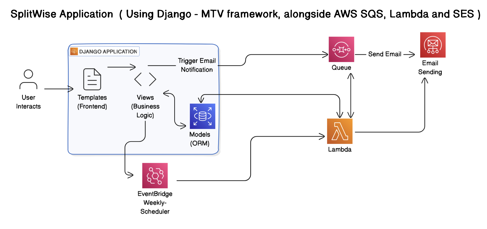

# Splitwise Application
This application allows users to manage shared expenses among a group of people. It calculates how much each person owes or is owed, keeps track of balances between users and simplifies the process of settling debts.
This application has been built using Django in the cloud, along with AWS resources for handling notifications and messaging related activities.

## System Design

The system is built around managing user expenses and sending notifications asynchronously using AWS resources. The design focuses on handling user management, expense management, balance management, and email notifications efficiently. Below is a breakdown of the system components with key AWS integrations.


### Components :
- Django Application exhibiting MTV(Model-Template-View) framework (Hosted on AWS Elastic Beanstalk)
- AWS RDS Managed service (Model)
- AWS SQS (Message queuing for Asynchronous processing of email notifications)
- AWS SES (Simple Email Service for sending emails)
- AWS EventBridge (Scheduling & Triggering Weekly emails)
- AWS Lambda Function (Fetching data from RDS and sending weekly mails to SES)

### Components Breakdown :

#### 1. User Management
Handle all operations related to users, including creation, retrieval, and management of user information.

- Workflow
    >User Registration:
    - Users are registered through Django Frontend
    - Templates : Acting as frontend in HTML, it provides forms for inputting user details
    - Views : Validate and process the registration data
    - Models : Save user information into the RDS PostgreSQL database

    >User Retrieval:
    - User details can be retrieved and displayed through various templates
    - Views : Fetch user data from models and render appropriate templates

    >Restrictions:
    - N/A

#### 2, Expense Management
Facilitate adding, updating, and viewing expenses shared among users

- Workflow
    >User Interaction:
    - A user submits an expense through a Django form(template)

    >Request Processing:
    - Views : Validate input data and determine the split logic based on the specified split_type (EQUAL, EXACT, PERCENTAGE)

    >Data Persistence:
    - Models : Save expense details and respective participant shares into the database

    >Notification Triggering:
    - For each participant, a message is sent to AWS SQS queue to trigger email notifications

    >Viewing Expenses:
    - Users can view detailed lists of expenses they are involved in
    - Views : Retrieve expense data from models and render them using templates.

    >Restrictions:
    - %age and values in PERCENTAGE and EXACT respectively, should be upto 2 decimal places
    - Total expense and values provided should match in either case
    - Per Expense participant limitation <= 1000
    - Per Expense pool size <= 1 CR INR

#### 3. Balance Management
Track and manage the amounts owed between users resulting from shared expenses.

- Workflow
    >Updating Balances:
    - Whenever an expense is added, balances between users are updated accordingly
    - Views : Calculate new balances based on expense shares
    - Models : Persist updated balances in the database

    >Viewing Balances:
    - Users can view their current balances with other users
    - Views : Retrieve balance information and render through templates

    >Simplifying Balances:
    - By enabling a flag, balances can be simplified to minimize the number of transactions needed for settlement
    - Views : Apply simplification algorithms and update balances accordingly

    >Restrictions:
    - Users with non-zero balance should be available whenever queried


#### 4. Notification Management
Inform users about their expenses and balances through email notifications.

- Workflow
    >Expense Addition Notification
    - Message Queueing : When an expense is added, the application sends a message to an AWS SQS queue for each participant

    >Processing Messages
    - An AWS Lambda function is triggered by new messages in the SQS queue.
    - Lambda : 
        - Extracts message details
        - Sends emails using AWS SES
    
    >Weekly Summary Notification
    - Scheduling with EventBridge : An event rule is set up with a cron expression to trigger Lambda function
    - Lambda Function Execution : 
        - Fetches all users and their outstanding balances from the RDS PostgreSQL database
        - Composes and sends summary emails via AWS SES


## API Contracts

1. Create User
    - Endpoint: `POST /users`
    - Description: Registers a new user
    - Content:
    ```json
    {
        "name": string,
        "email": string,
        "mobile_number": integer
    }
    ```

2. Create Expense
    - Endpoint: `POST /expenses`
    - Description: Creates a new expense and splits it among participants
    - Content:
    ```json
    {
        "paid_by": integer, // userid
        "amount": integer,
        "split_type": string, // "EQUAL" / "EXACT" / "PERCENTAGE"
        "participants": list, // [1,2,3,4] (userid in a list)
        "description": string
    }
    ```

3. Get User Balances
    - Endpoint: `GET /users/{userid}/balances`
    - Description: Retrieves all balances for a specific user
    - Response:
    ```json
    {
        "userid": integer,
        "balances": [
            {
            "to_user": integer, // owes to
            "amount": integer
        },
        ...... // more userid that the queried user owes to
        ......
        ]
    }
    ```

4. Get Expense Details
    - Endpoint: `GET expenses/{expenseid}`
    - Description: Retrieves detailed information about a specific expense.
    - Response:
    ```json
    {
        "expenseid": integer,
        "paid_by": integer, // userid
        "amount": integer,
        "split_type": string,
        "description": string,
        "participants": [
            {
                "userid": integer,
                "amount": integer
            },
            ...........
            ...........

        ] }
    ```

## Class Structures

### 1. User Class:

- Attributes:
    - `user_id`
    - `name`
    - `email`
    - `mobile_number`

- Methods:
    - `create`
    - `update`
    - `get_user_by_id`

### 2. Expense Class:

- Attributes:
    - `expense_id`
    - `amount`
    - `split_type`
    - `created_by`
    - `participants`

- Methods:
    - `create`
    - `add_participant`
    - `split_expense`

### 3. Balance Class:

- Attributes:
    - `balance_id`
    - `from_user`
    - `to_user`
    - `amount`
    - `expense`

- Methods:
    - `get_balance_by_user`
    - `update_balance`

